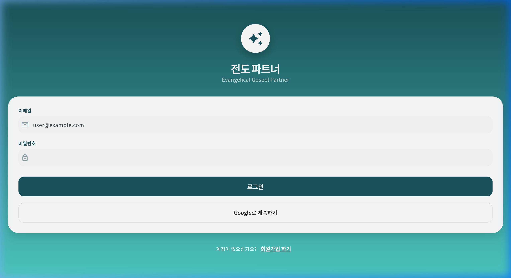
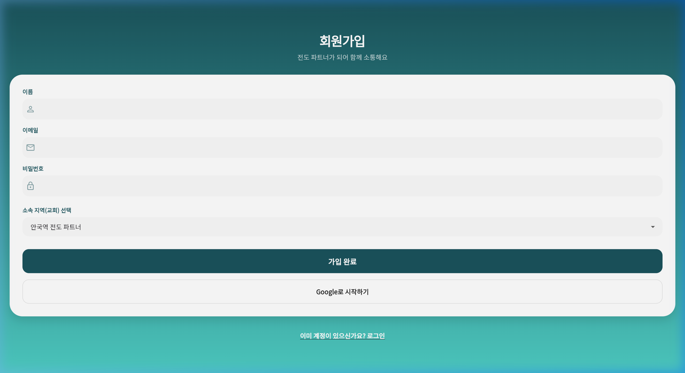
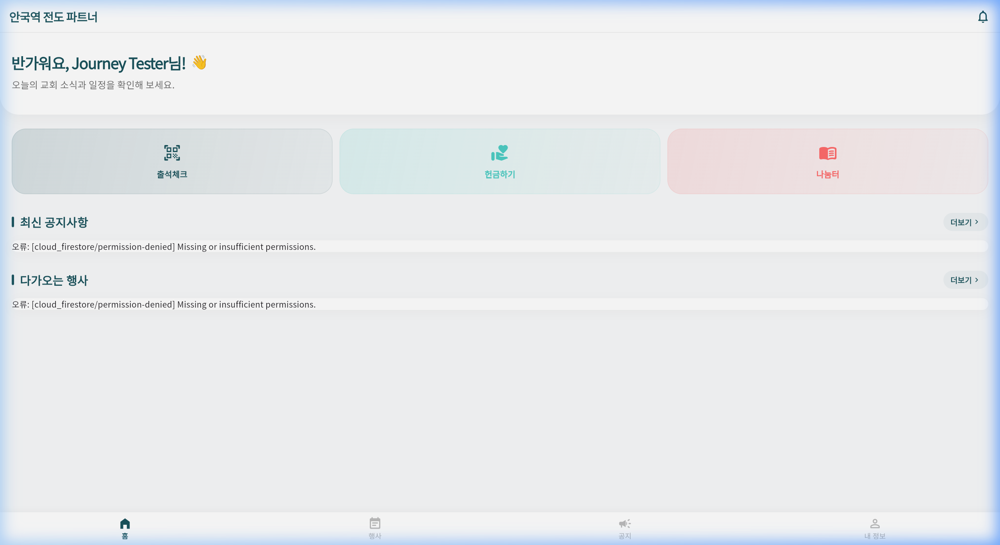
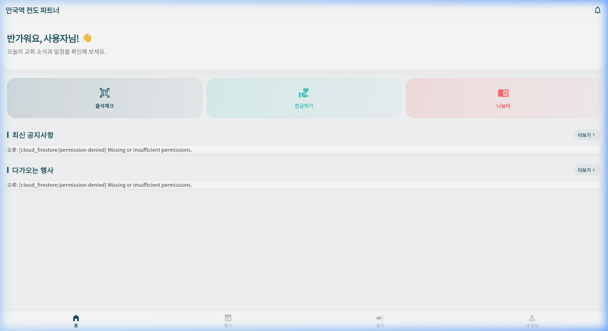

# 🚇 전도 파트너 플랫폼 (Evangelical Gospel Partner)

> **"당근처럼 친근하게, 지하철처럼 체계적으로"**
> 각 지역별 독립적인 브랜딩과 강력한 마스터 제어 기능을 제공하는 프리미엄 지역 통합 플랫폼입니다.

---

## ✨ 핵심 기능 하이라이트 (Feature Highlights)

### 🎨 노선별 동적 테마 (Dynamic Branding)
- **지하철 노선 아이덴티티**: 안국역(3호선-주황), 삼성역(2호선-연두), 판교역(신분당선-빨강) 등 각 지역의 상징색과 역명판 디자인이 앱 전체에 실시간 반영됩니다.
- **WOW 디자인**: 현대적인 글래스모피즘(Glassmorphism)과 매끄러운 애니메이션이 적용된 프리미엄 UI/UX.

### 🏢 지능형 멀티 테넌트 (Multi-tenant Architecture)
- **독립 테이블 구조**: 구역별로 사용자 데이터를 분리 관리하여 보안과 독립성을 보장합니다.
- **다중 구역 가입**: 한 명의 사용자가 여러 구역의 파트너로 활동할 수 있으며, 각 구역의 DB에 계정 정보가 안전하게 동기화됩니다.

### 🛡️ 마스터 관리자 시스템 (Admin Master Panel)
- **통합 관제**: 모든 구역의 사용자, 블랙리스트, 공지사항을 하나의 대시보드에서 통제합니다.
- **블랙리스트 제어**: 부적절한 사용자를 즉시 전역/지역별로 차단하고 관리할 수 있습니다.
- **강력한 보안**: 7일 단위 PITR(Point-in-Time Recovery) 및 매일 자정 자동 백업 시스템 구축.

---

## 📱 사용자 여정 가이드 (User Journey Walkthrough)

전도 파트너 플랫폼의 핵심 사용자 여정을 단계별로 안내합니다.

### 1. 시작 및 로그인 (Landing & Login)

*   **Google로 시작하기**: 별도의 복잡한 가입 절차 없이 구글 계정으로 즉시 시작할 수 있습니다.
*   **Email 로그인**: 테스트 및 운영을 위한 이메일 로그인 기능이 포함되어 있습니다.

### 2. 지역 선택 및 회원가입 (Signup & Region Selection)

*   **소속 선택**: 가입 시 본인이 활동할 지역(테넌트)을 선택합니다. 선택한 지역에 따라 앱의 테마 색상과 로고가 자동으로 설정됩니다.

### 3. 홈 화면 및 지역별 브랜딩 (Dynamic Branding)

*   **안국역 파트너**: 3호선의 주황색 테마와 역명판 스타일의 상단 이미지가 적용된 모습입니다.

### 4. 당근 스타일 지역 전환 (Region Switcher)

*   **간편한 전환**: 상단 왼쪽의 지역명을 클릭하면 하단 시트가 나타나며, 가입된 다른 지역으로 즉시 이동할 수 있습니다.

### 5. 다중 구역 활동 (Multi-Region Support)

*   **삼성역 파트너**: 같은 계정으로 삼성역에 가입하면 2호선 연두색 테마로 자동 전환되며, 해당 지역의 공지와 행사를 별도로 관리합니다.

### 6. 운영자 마스터 패널 (Admin Master Dashboard)
> **[관리자 전용 기능]**
*   **사용자 관리**: 전체 가입자 목록을 확인하고 승인 상태를 제어합니다.
*   **전역 블랙리스트**: 어뷰징 사용자를 차단하고 차단 사유를 명시하여 관리합니다.
*   **통합 공지 제어**: 모든 지역의 공지사항을 한눈에 보고 수정하거나 삭제할 수 있습니다.

*   **보안 로그아웃**: 안전한 세션 종료를 지원하며, 관리자 메뉴는 권한이 있는 계정에게만 사이드바에 노출됩니다.

---

## 🛠️ 기술적 세부 사항 (Technical Details)

### 🔒 보안 및 환경 설정
*   **PITR 및 백업**: 랜섬웨어 등 보안 사고에 대비한 [백업 및 복구 가이드](docs/BACKUP_AND_RESTORE.md)를 참고하세요.
*   **계정 관리 시스템**: 실제 서비스 및 테스트를 위한 마스터 관리자/운영자 계정 정보는 보안을 위해 `private/` 폴더 내에서 별도로 관리됩니다.
    *   `private/OFFICIAL_ACCOUNTS.md`: 공식 관리 계정 목록 및 강력한 비밀번호 정보 (이 폴더는 **`.gitignore` 설정에 의해 깃허브(GitHub) 공유 대상에서 엄격히 제외**되어 로컬에만 유지됩니다.)
*   **민감 정보**: API 키 및 키스토어는 깃허브에 공유되지 않으며, `.gitignore`를 통해 철저히 보호됩니다.

### 🧪 테스트 및 배포
*   **단위 테스트**: `flutter test test/unit/admin_logic_test.dart` (관리자 권한 및 블랙리스트 로직 검증 완료)
*   **자동 배포**: GitHub Actions를 통해 웹(GitHub Pages) 및 안드로이드(AAB) 빌드가 자동 수행됩니다.

---

## 🚀 업데이트 내역 (Antigravity Agent)
- **Admin Dashboard**: 통합 관리 기능, 블랙리스트 탭, 공지 삭제 기능 구현.
- **Multi-Tenant Sync**: 사용자 정보의 구역별 독립 테이블 동기화 및 중복 가입 로직 강화.
- **CI/CD Fix**: `firebase_auth_web` 컴파일 오류 해결 및 전체 빌드 성공 확인.
- **UI/UX**: 노선별 컬러 시스템 완성 및 사용자 여정 문서화.
